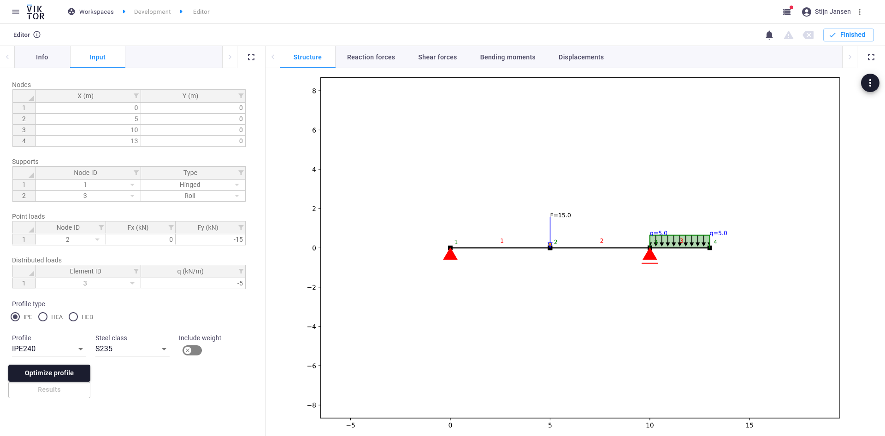
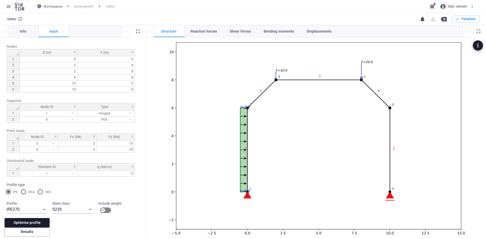
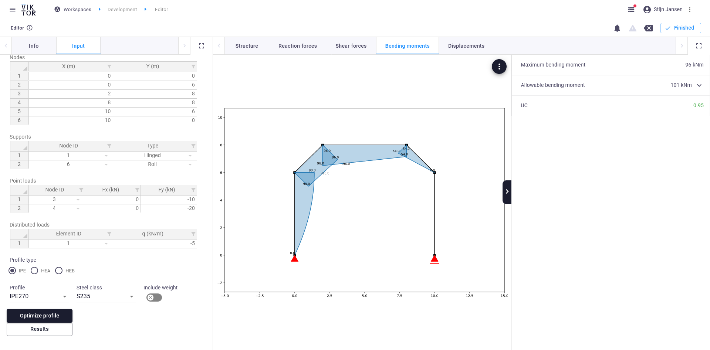

# Beam analysis
This app can be used to perform 2D structural beam calculations. With this app you can:
1. Parametrically define the geometry, from a simple beam to a complex truss structure
2. Apply supports, point loads and distributed loads
3. Select a steel profile from a standard library (IPE, HEA, HEB)
4. Calculate and visualize resulting reaction forces, shear forces, bending moments and displacements
5. Optimize the required steel profile (based on bending moment)

The app can be used for calculating simple beam structures:

But also more complex truss structures:

Of which the bending moments and required steel profile can be determined quickly:

The calculation core of the app is **anaStruct** ([docs](https://anastruct.readthedocs.io/en/latest/), 
[github](https://github.com/ritchie46/anaStruct)), a wonderful Python package created by [Ritchie Vink](https://www.ritchievink.com/).

A published version of this app is available on [demo.viktor.ai](https://demo.viktor.ai/public/beam-structural-analysis).

Ideas on improvements can be posted [here](https://github.com/viktor-platform/beam-analysis-app/discussions/categories/ideas).

*Note that this is not a validated software package. The app can only be used for indicative calculations, 
correct results are not guaranteed.*

## App structure
This is an editor-only app type.